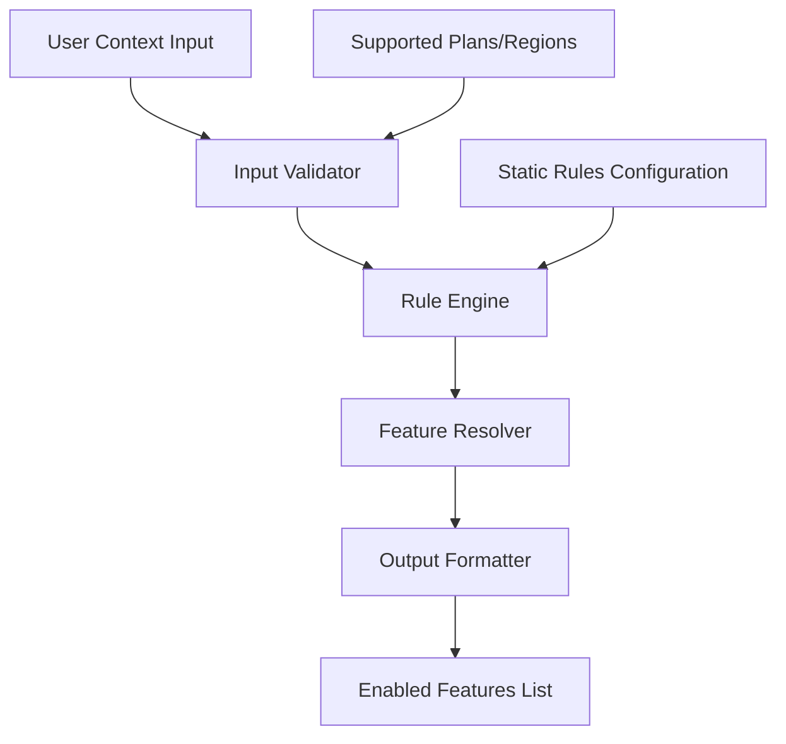

# Design Document: Feature Flag Evaluator

## Overview

The Feature Flag Evaluator is a lightweight, rule-based system that determines which features should be enabled for users based on their context (userId, region, plan). The system follows a simple evaluation model where static rules map user attributes to feature sets, providing predictable and fast feature flag decisions.

The evaluator operates as a pure function, taking user context as input and returning a list of enabled features. This design ensures deterministic behavior, easy testing, and minimal complexity while meeting the core requirements for controlled feature rollouts.

Key design principles:
- **Simplicity**: Static rule evaluation with no external dependencies
- **Performance**: Sub-100ms evaluation time through in-memory rule processing
- **Predictability**: Deterministic outcomes based on clear rule logic
- **Extensibility**: Rule structure allows for future enhancement without breaking changes

## Architecture

The system follows a layered architecture with clear separation of concerns:



### Core Components

1. **Input Validator**: Validates user context structure and values
2. **Rule Engine**: Applies static rules to determine applicable features
3. **Feature Resolver**: Combines rule results and removes duplicates
4. **Output Formatter**: Formats results consistently (sorted, unique)
5. **Configuration Store**: Holds static rules and supported values

### Data Flow

1. User context enters through the main evaluation interface
2. Input validator checks for required fields and valid values
3. Rule engine evaluates all applicable rules based on user attributes
4. Feature resolver combines results from multiple rules
5. Output formatter ensures consistent response format
6. Final feature list is returned to caller

## Components and Interfaces

### FeatureFlagEvaluator (Main Interface)

```typescript
interface FeatureFlagEvaluator {
  evaluate(context: UserContext): EvaluationResult
  getAvailableFeatures(): string[]
  getSupportedPlans(): string[]
  getSupportedRegions(): string[]
}
```

### UserContext (Input Model)

```typescript
interface UserContext {
  userId: string
  region: string
  plan: string
}
```

### EvaluationResult (Output Model)

```typescript
interface EvaluationResult {
  success: boolean
  features?: string[]
  error?: string
}
```

### RuleEngine (Core Logic)

```typescript
interface RuleEngine {
  evaluateRules(context: UserContext): string[]
}

interface FeatureRule {
  id: string
  conditions: RuleCondition[]
  features: string[]
}

interface RuleCondition {
  attribute: 'plan' | 'region' | 'userId'
  operator: 'equals' | 'in'
  value: string | string[]
}
```

### InputValidator (Validation Logic)

```typescript
interface InputValidator {
  validate(context: UserContext): ValidationResult
}

interface ValidationResult {
  isValid: boolean
  errors: string[]
}
```

## Data Models

### Static Rule Configuration

The system uses a predefined set of rules that map user attributes to features:

```typescript
const FEATURE_RULES: FeatureRule[] = [
  {
    id: 'pro-plan-features',
    conditions: [
      { attribute: 'plan', operator: 'equals', value: 'Pro' }
    ],
    features: ['advanced-analytics', 'premium-support', 'api-access']
  },
  {
    id: 'basic-plan-features',
    conditions: [
      { attribute: 'plan', operator: 'equals', value: 'Basic' }
    ],
    features: ['basic-dashboard', 'standard-support']
  },
  {
    id: 'us-region-features',
    conditions: [
      { attribute: 'region', operator: 'equals', value: 'US' }
    ],
    features: ['us-payment-gateway', 'us-compliance-tools']
  },
  {
    id: 'eu-region-features',
    conditions: [
      { attribute: 'region', operator: 'equals', value: 'EU' }
    ],
    features: ['gdpr-tools', 'eu-payment-gateway']
  }
]
```

### Supported Values

```typescript
const SUPPORTED_PLANS = ['Basic', 'Pro']
const SUPPORTED_REGIONS = ['US', 'EU']
```

### Feature Catalog

```typescript
const ALL_FEATURES = [
  'advanced-analytics',
  'premium-support', 
  'api-access',
  'basic-dashboard',
  'standard-support',
  'us-payment-gateway',
  'us-compliance-tools',
  'gdpr-tools',
  'eu-payment-gateway'
]
```

### Error Types

```typescript
enum EvaluationError {
  MISSING_CONTEXT = 'Missing or null user context',
  INVALID_USER_ID = 'Invalid or empty userId',
  UNSUPPORTED_REGION = 'Unsupported region',
  UNSUPPORTED_PLAN = 'Unsupported plan',
  VALIDATION_FAILED = 'Input validation failed'
}
```

## Correctness Properties

*A property is a characteristic or behavior that should hold true across all valid executions of a system-essentially, a formal statement about what the system should do. Properties serve as the bridge between human-readable specifications and machine-verifiable correctness guarantees.*

### Property 1: Valid input produces valid output
*For any* valid UserContext (with non-empty userId, supported region, and supported plan), the Feature_Flag_Evaluator should return a success response containing an array of feature identifiers
**Validates: Requirements 1.1, 5.1**

### Property 2: Invalid userId rejection
*For any* UserContext with invalid userId (null, empty, or whitespace-only), the Feature_Flag_Evaluator should return an error response indicating invalid user identification
**Validates: Requirements 1.2**

### Property 3: Invalid region rejection  
*For any* UserContext with unsupported region value, the Feature_Flag_Evaluator should return an error response indicating unsupported region
**Validates: Requirements 1.3, 3.3**

### Property 4: Invalid plan rejection
*For any* UserContext with unsupported plan value, the Feature_Flag_Evaluator should return an error response indicating unsupported plan
**Validates: Requirements 1.4, 3.4**

### Property 5: Pro plan feature inclusion
*For any* valid UserContext with plan "Pro", the returned feature list should include all premium features (advanced-analytics, premium-support, api-access)
**Validates: Requirements 2.1**

### Property 6: Basic plan feature restriction
*For any* valid UserContext with plan "Basic", the returned feature list should include only basic features and exclude premium features
**Validates: Requirements 2.2**

### Property 7: US region feature inclusion
*For any* valid UserContext with region "US", the returned feature list should include US-specific features (us-payment-gateway, us-compliance-tools)
**Validates: Requirements 2.3**

### Property 8: EU region feature inclusion and US exclusion
*For any* valid UserContext with region "EU", the returned feature list should include EU-specific features (gdpr-tools, eu-payment-gateway) and exclude US-only features
**Validates: Requirements 2.4**

### Property 9: Rule combination (union of features)
*For any* valid UserContext that matches multiple rules, the returned feature list should contain the union of all applicable features from matching rules
**Validates: Requirements 2.5**

### Property 10: Input validation before processing
*For any* invalid UserContext, the Feature_Flag_Evaluator should return an error without attempting rule evaluation
**Validates: Requirements 3.5**

### Property 11: Deterministic evaluation
*For any* UserContext, evaluating it multiple times should always produce identical results
**Validates: Requirements 4.1, 4.5**

### Property 12: Unique feature identifiers
*For any* successful evaluation result, the returned feature list should contain no duplicate feature identifiers
**Validates: Requirements 5.4**

### Property 13: Consistent feature ordering
*For any* successful evaluation result, the returned feature identifiers should be in alphabetical order
**Validates: Requirements 5.5**

### Property 14: Error response structure
*For any* invalid UserContext, the Feature_Flag_Evaluator should return an error response with a descriptive error message
**Validates: Requirements 5.2**

## Error Handling

The system implements comprehensive error handling with clear error messages and consistent response formats:

### Validation Errors
- **Missing Context**: When UserContext is null or undefined
- **Invalid UserId**: When userId is empty, null, or contains only whitespace
- **Unsupported Region**: When region is not in ['US', 'EU']
- **Unsupported Plan**: When plan is not in ['Basic', 'Pro']

### Error Response Format
All errors follow a consistent structure:
```typescript
{
  success: false,
  error: "Descriptive error message"
}
```

### Error Handling Strategy
1. **Fail Fast**: Validate all inputs before any processing
2. **Clear Messages**: Provide specific, actionable error descriptions
3. **Consistent Format**: All errors use the same response structure
4. **No Partial Results**: Either return complete success or clear failure

## Testing Strategy

The testing approach combines unit testing for specific examples and property-based testing for comprehensive coverage:

### Unit Testing
- **Specific Examples**: Test known input/output pairs for each rule
- **Edge Cases**: Test boundary conditions and error scenarios
- **Integration Points**: Test component interactions and data flow
- **Configuration Validation**: Test rule configuration and supported values

### Property-Based Testing
- **Universal Properties**: Test properties that should hold for all valid inputs
- **Error Conditions**: Test that invalid inputs consistently produce errors
- **Rule Combinations**: Test that multiple applicable rules combine correctly
- **Output Format**: Test that responses maintain consistent structure and ordering

### Testing Configuration
- **Framework**: Use a property-based testing library appropriate for the chosen implementation language
- **Iterations**: Minimum 100 iterations per property test to ensure comprehensive coverage
- **Test Tagging**: Each property test tagged with format: **Feature: feature-flag-evaluator, Property {number}: {property_text}**

### Test Coverage Goals
- **Functional Coverage**: All requirements validated through corresponding properties
- **Error Coverage**: All error conditions tested with appropriate inputs
- **Rule Coverage**: All static rules tested individually and in combination
- **Format Coverage**: All response formats validated for consistency