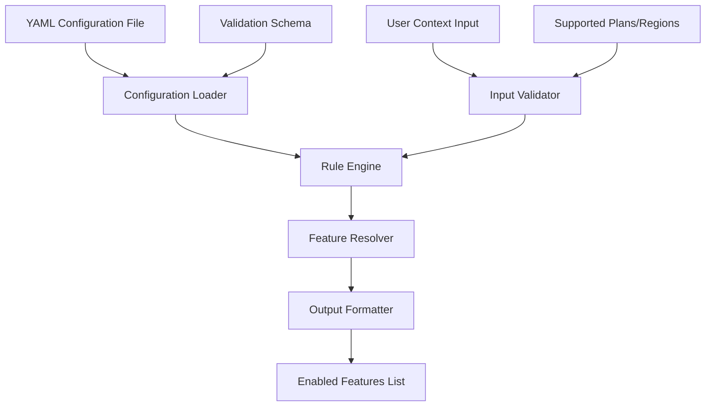

# Design Document: Feature Flag Evaluator

## Overview

The Feature Flag Evaluator is a lightweight, rule-based system that determines which features should be enabled for users based on their context (userId, region, plan). The system loads feature rules from YAML configuration files, providing a data-driven approach where rules can be modified without code changes. This design ensures flexibility, maintainability, and easy configuration management while meeting the core requirements for controlled feature rollouts.

The evaluator operates by loading configuration at startup, then functioning as a pure evaluation engine that takes user context as input and returns a list of enabled features. This design ensures deterministic behavior, easy testing, and configuration flexibility while maintaining high performance through in-memory rule processing.

Key design principles:
- **Data-Driven**: Rules loaded from YAML configuration files for easy modification
- **Performance**: Sub-100ms evaluation time through in-memory rule processing after initial load
- **Predictability**: Deterministic outcomes based on clear rule logic
- **Flexibility**: Configuration changes without code deployment
- **Extensibility**: Rule structure allows for future enhancement without breaking changes

## Architecture

The system follows a layered architecture with clear separation of concerns:



### Core Components

1. **Configuration Loader**: Loads and parses YAML configuration files, validates structure
2. **Input Validator**: Validates user context structure and values against loaded configuration
3. **Rule Engine**: Applies loaded rules to determine applicable features
4. **Feature Resolver**: Combines rule results and removes duplicates
5. **Output Formatter**: Formats results consistently (sorted, unique)

### Data Flow

1. System startup loads YAML configuration file through Configuration Loader
2. Configuration is validated and parsed into internal rule structures
3. User context enters through the main evaluation interface
4. Input validator checks for required fields and valid values against loaded configuration
5. Rule engine evaluates all applicable rules based on user attributes
6. Feature resolver combines results from multiple rules
7. Output formatter ensures consistent response format
8. Final feature list is returned to caller

## Components and Interfaces

### FeatureFlagEvaluator (Main Interface)

```typescript
interface FeatureFlagEvaluator {
  loadConfiguration(configPath: string): Promise<ConfigurationResult>
  evaluate(context: UserContext): EvaluationResult
  getAvailableFeatures(): string[]
  getSupportedPlans(): string[]
  getSupportedRegions(): string[]
}
```

### ConfigurationLoader (YAML Processing)

```typescript
interface ConfigurationLoader {
  loadFromFile(filePath: string): Promise<ConfigurationResult>
  validateConfiguration(config: any): ValidationResult
}

interface ConfigurationResult {
  success: boolean
  configuration?: FeatureFlagConfiguration
  error?: string
}

interface FeatureFlagConfiguration {
  rules: FeatureRule[]
  supportedPlans: string[]
  supportedRegions: string[]
  features: FeatureDefinition[]
}

interface FeatureDefinition {
  id: string
  name: string
  description?: string
}
```

### UserContext (Input Model)

```typescript
interface UserContext {
  userId: string
  region: string
  plan: string
}
```

### EvaluationResult (Output Model)

```typescript
interface EvaluationResult {
  success: boolean
  features?: string[]
  error?: string
}
```

### RuleEngine (Core Logic)

```typescript
interface RuleEngine {
  evaluateRules(context: UserContext): string[]
}

interface FeatureRule {
  id: string
  conditions: RuleCondition[]
  features: string[]
}

interface RuleCondition {
  attribute: 'plan' | 'region' | 'userId'
  operator: 'equals' | 'in'
  value: string | string[]
}
```

### InputValidator (Validation Logic)

```typescript
interface InputValidator {
  validate(context: UserContext): ValidationResult
}

interface ValidationResult {
  isValid: boolean
  errors: string[]
}
```

## Data Models

### YAML Configuration Structure

The system loads configuration from a YAML file with the following structure:

```yaml
# feature-flags.yml
supportedPlans:
  - Basic
  - Pro

supportedRegions:
  - US
  - EU

features:
  - id: advanced-analytics
    name: Advanced Analytics
    description: Advanced reporting and analytics features
  - id: premium-support
    name: Premium Support
    description: 24/7 premium customer support
  - id: api-access
    name: API Access
    description: Full REST API access
  - id: basic-dashboard
    name: Basic Dashboard
    description: Standard dashboard functionality
  - id: standard-support
    name: Standard Support
    description: Business hours customer support
  - id: us-payment-gateway
    name: US Payment Gateway
    description: US-specific payment processing
  - id: us-compliance-tools
    name: US Compliance Tools
    description: US regulatory compliance features
  - id: gdpr-tools
    name: GDPR Tools
    description: EU GDPR compliance features
  - id: eu-payment-gateway
    name: EU Payment Gateway
    description: EU-specific payment processing

rules:
  - id: pro-plan-features
    conditions:
      - attribute: plan
        operator: equals
        value: Pro
    features:
      - advanced-analytics
      - premium-support
      - api-access
  
  - id: basic-plan-features
    conditions:
      - attribute: plan
        operator: equals
        value: Basic
    features:
      - basic-dashboard
      - standard-support
  
  - id: us-region-features
    conditions:
      - attribute: region
        operator: equals
        value: US
    features:
      - us-payment-gateway
      - us-compliance-tools
  
  - id: eu-region-features
    conditions:
      - attribute: region
        operator: equals
        value: EU
    features:
      - gdpr-tools
      - eu-payment-gateway
```

### Internal Rule Configuration

After loading from YAML, the configuration is converted to internal TypeScript structures:

```typescript
interface LoadedConfiguration {
  rules: FeatureRule[]
  supportedPlans: string[]
  supportedRegions: string[]
  features: Map<string, FeatureDefinition>
}
```

### Configuration Validation Schema

```typescript
interface ConfigurationSchema {
  supportedPlans: string[]
  supportedRegions: string[]
  features: FeatureDefinition[]
  rules: FeatureRule[]
}

// Validation rules:
// - All rule conditions must reference valid plans/regions from supportedPlans/supportedRegions
// - All rule features must reference valid feature IDs from features array
// - Feature IDs must be unique
// - Plan and region values must be non-empty strings
```

### Error Types

```typescript
enum EvaluationError {
  // Configuration errors
  CONFIG_FILE_NOT_FOUND = 'Configuration file not found',
  CONFIG_PARSE_ERROR = 'Failed to parse YAML configuration',
  CONFIG_VALIDATION_ERROR = 'Configuration validation failed',
  CONFIG_NOT_LOADED = 'Configuration not loaded - call loadConfiguration first',
  
  // Input validation errors
  MISSING_CONTEXT = 'Missing or null user context',
  INVALID_USER_ID = 'Invalid or empty userId',
  UNSUPPORTED_REGION = 'Unsupported region',
  UNSUPPORTED_PLAN = 'Unsupported plan',
  VALIDATION_FAILED = 'Input validation failed'
}
```

## Correctness Properties

*A property is a characteristic or behavior that should hold true across all valid executions of a system-essentially, a formal statement about what the system should do. Properties serve as the bridge between human-readable specifications and machine-verifiable correctness guarantees.*

### Property 1: Valid input produces valid output
*For any* valid UserContext (with non-empty userId, supported region, and supported plan), the Feature_Flag_Evaluator should return a success response containing an array of feature identifiers
**Validates: Requirements 1.1, 5.1**

### Property 2: Invalid userId rejection
*For any* UserContext with invalid userId (null, empty, or whitespace-only), the Feature_Flag_Evaluator should return an error response indicating invalid user identification
**Validates: Requirements 1.2**

### Property 3: Invalid region rejection  
*For any* UserContext with unsupported region value, the Feature_Flag_Evaluator should return an error response indicating unsupported region
**Validates: Requirements 1.3, 3.3**

### Property 4: Invalid plan rejection
*For any* UserContext with unsupported plan value, the Feature_Flag_Evaluator should return an error response indicating unsupported plan
**Validates: Requirements 1.4, 3.4**

### Property 5: Pro plan feature inclusion
*For any* valid UserContext with plan "Pro", the returned feature list should include all premium features (advanced-analytics, premium-support, api-access)
**Validates: Requirements 2.1**

### Property 6: Basic plan feature restriction
*For any* valid UserContext with plan "Basic", the returned feature list should include only basic features and exclude premium features
**Validates: Requirements 2.2**

### Property 7: US region feature inclusion
*For any* valid UserContext with region "US", the returned feature list should include US-specific features (us-payment-gateway, us-compliance-tools)
**Validates: Requirements 2.3**

### Property 8: EU region feature inclusion and US exclusion
*For any* valid UserContext with region "EU", the returned feature list should include EU-specific features (gdpr-tools, eu-payment-gateway) and exclude US-only features
**Validates: Requirements 2.4**

### Property 9: Rule combination (union of features)
*For any* valid UserContext that matches multiple rules, the returned feature list should contain the union of all applicable features from matching rules
**Validates: Requirements 2.5**

### Property 10: Input validation before processing
*For any* invalid UserContext, the Feature_Flag_Evaluator should return an error without attempting rule evaluation
**Validates: Requirements 3.5**

### Property 11: Deterministic evaluation
*For any* UserContext, evaluating it multiple times should always produce identical results
**Validates: Requirements 4.1, 4.5**

### Property 12: Unique feature identifiers
*For any* successful evaluation result, the returned feature list should contain no duplicate feature identifiers
**Validates: Requirements 5.4**

### Property 13: Consistent feature ordering
*For any* successful evaluation result, the returned feature identifiers should be in alphabetical order
**Validates: Requirements 5.5**

### Property 14: Error response structure
*For any* invalid UserContext, the Feature_Flag_Evaluator should return an error response with a descriptive error message
**Validates: Requirements 6.2**

### Property 15: Valid YAML configuration loading
*For any* valid YAML configuration file with proper structure, the Feature_Flag_Evaluator should successfully load and parse the configuration into internal Feature_Rules
**Validates: Requirements 4.1**

### Property 16: Invalid rule structure validation
*For any* YAML configuration with valid syntax but invalid rule structure, the Feature_Flag_Evaluator should return an error indicating invalid rule format
**Validates: Requirements 4.4**

### Property 17: Configuration referential integrity
*For any* YAML configuration where rules reference undefined features, plans, or regions, the Feature_Flag_Evaluator should return validation errors identifying the missing references
**Validates: Requirements 4.5**

### Property 18: Loaded rules evaluation equivalence
*For any* valid YAML configuration and user context, the Feature_Flag_Evaluator should evaluate rules loaded from YAML identically to equivalent static rules
**Validates: Requirements 5.1**

### Property 19: Dynamic feature query accuracy
*For any* loaded YAML configuration, querying for available features should return exactly the Feature_Identifiers defined in the configuration
**Validates: Requirements 5.2**

### Property 20: Dynamic plan query accuracy
*For any* loaded YAML configuration, querying for supported plans should return exactly the plan values defined in the configuration
**Validates: Requirements 5.3**

### Property 21: Dynamic region query accuracy
*For any* loaded YAML configuration, querying for supported regions should return exactly the region values defined in the configuration
**Validates: Requirements 5.4**

### Property 22: Configuration-based evaluation consistency
*For any* loaded YAML configuration and user context, evaluating the same context multiple times should always produce identical results
**Validates: Requirements 5.5**

## Error Handling

The system implements comprehensive error handling with clear error messages and consistent response formats:

### Configuration Errors
- **Configuration File Not Found**: When the specified YAML file path does not exist
- **Configuration Parse Error**: When the YAML file contains invalid syntax
- **Configuration Validation Error**: When the YAML structure is invalid or incomplete
- **Configuration Not Loaded**: When evaluation is attempted before loading configuration
- **Referential Integrity Error**: When rules reference undefined features, plans, or regions

### Validation Errors
- **Missing Context**: When UserContext is null or undefined
- **Invalid UserId**: When userId is empty, null, or contains only whitespace
- **Unsupported Region**: When region is not in the loaded configuration's supported regions
- **Unsupported Plan**: When plan is not in the loaded configuration's supported plans

### Error Response Format
All errors follow a consistent structure:
```typescript
{
  success: false,
  error: "Descriptive error message"
}
```

### Error Handling Strategy
1. **Configuration First**: Validate configuration completely before allowing evaluations
2. **Fail Fast**: Validate all inputs before any processing
3. **Clear Messages**: Provide specific, actionable error descriptions
4. **Consistent Format**: All errors use the same response structure
5. **No Partial Results**: Either return complete success or clear failure

## Testing Strategy

The testing approach combines unit testing for specific examples and property-based testing for comprehensive coverage:

### Unit Testing
- **Configuration Loading**: Test YAML parsing with various valid and invalid configurations
- **Specific Examples**: Test known input/output pairs for each rule
- **Edge Cases**: Test boundary conditions and error scenarios
- **Integration Points**: Test component interactions and data flow
- **Configuration Validation**: Test rule configuration validation and referential integrity

### Property-Based Testing
- **Configuration Properties**: Test that any valid YAML configuration loads and works correctly
- **Universal Properties**: Test properties that should hold for all valid inputs
- **Error Conditions**: Test that invalid inputs consistently produce errors
- **Rule Combinations**: Test that multiple applicable rules combine correctly
- **Output Format**: Test that responses maintain consistent structure and ordering
- **Dynamic Configuration**: Test that loaded configurations behave identically to equivalent static configurations

### Testing Configuration
- **Framework**: Use a property-based testing library appropriate for the chosen implementation language
- **Iterations**: Minimum 100 iterations per property test to ensure comprehensive coverage
- **Test Tagging**: Each property test tagged with format: **Feature: feature-flag-evaluator, Property {number}: {property_text}**

### Test Coverage Goals
- **Functional Coverage**: All requirements validated through corresponding properties
- **Configuration Coverage**: All YAML loading and validation scenarios tested
- **Error Coverage**: All error conditions tested with appropriate inputs
- **Rule Coverage**: All loaded rules tested individually and in combination
- **Format Coverage**: All response formats validated for consistency
- **Dynamic Behavior**: All configuration-driven behavior tested against static equivalents